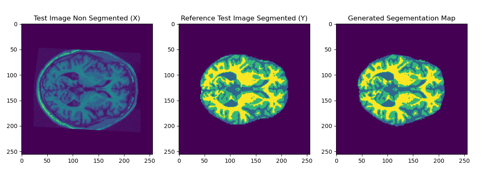

# Segmentation Mapping of MRI Brain Scans via U-Net Model
## Logan De Groot

This is a basic model U-Net Model that performs image segmentation on a given dataset to output a mapping.
This specific model has beene built via the use of `pytorch` and the following dataset:
https://cloudstor.aarnet.edu.au/plus/s/tByzSZzvvVh0hZA

The U-Net model was trained on the entire training set for 20 epochs and produced the following outputs:

To use this network everything is handled by the `runner.py` file. To train and generate your own model simply run the file. To generate a comparison image run with the command `python3 runner.py show`

The model is available upon request. 
